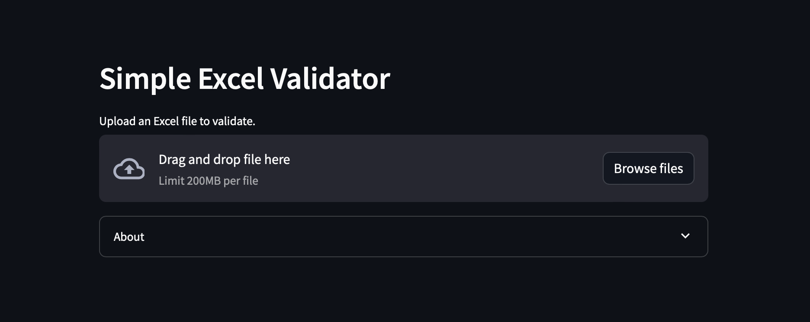

# xlsx-validator

Boilerplate code for a customer-facing Microsoft Excel validator.



## Installation

1. **Launch from terminal**
    ```sh
    streamlit run app.py
    ```

## Install with Docker

1. **Clone this repository**

    ```sh
    git clone https://github.com/wlinds/xlsx-validator.git
    ```

2. **Build the Docker image**

    ```sh
    docker build -t xlsx-validator .
    ```

3. **Run the Docker container**

    ```sh
    docker run -p 8501:8501 xlsx-validator
    ```

4. **Access the application**

    Open your web browser and go to `http://localhost:8501`.

## Application Structure

```sh
src/
├── app.py # Main GUI
└── requirements.txt # Python dependencies
```